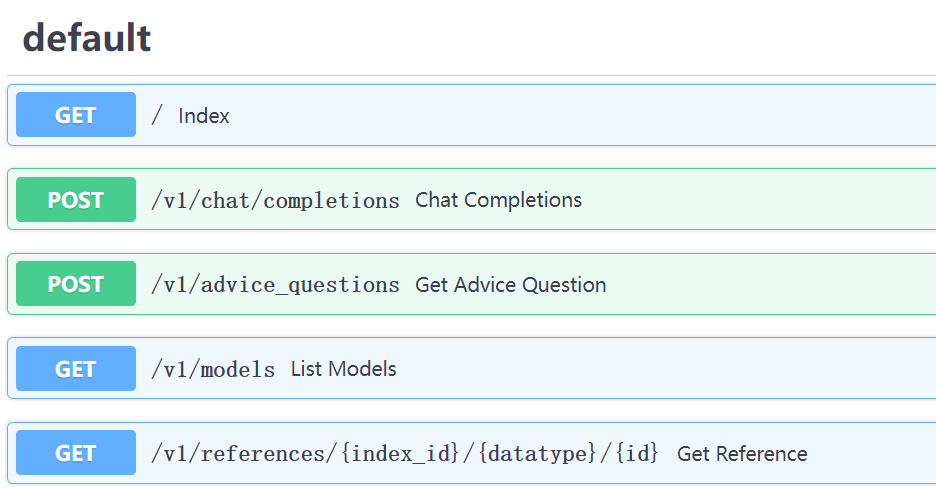

## 项目文件结构  
```
GRAPHRAG-CUTOMIZE
├─.github
├─.idea
├─.semversioner
├─.vscode
├─docsite
├─examples
├─examples_notebooks
├─graphrag                # 存放微软graphrag的源码
├─lancedb
├─output                  # 存放graphrag的输出结果
│  └─20240802-173526
│      ├─artifacts        # 存放提取的实体及关系等数据
│      └─reports
├─scripts
├─tests
└─webserver               # 项目主要web服务代码和工作区
    ├─configs             # 配置文件
    ├─gtypes
    ├─search
    ├─static
    ├─templates
    └─utils
```
iCAN目录下的requirements.txt是我自己所用虚拟环境的全部依赖，  
test.py是微软GraphRAG的Global Search功能的示例代码，  
prompts.txt是在对话系统中使用的提示词，包含作为初始设置的system prompt，和在对话中使用的user prompt（将用户在前端的输入进行包装），  
此外settings.yaml是GraphRAG的配置文件，作为备份  

webserver目录下的requirements.txt是所基于[开源项目](https://github.com/KylinMountain/graphrag-server) 的依赖，主要包括uvicorn、fastapi、neo4j等  

根目录下的README.md是原开源项目的README文件，可供参考  
## 如何安装How to install
- ~~克隆本项目 Clone the repo~~ 
- 建立虚拟环境 Create virtual env
```
conda create -n graphrag python=3.10
conda activate graphrag
```
或者使用pycharm创建虚拟环境（推荐）
```
# python -m venv graphrag-env
source graphrag-env/bin/activate
```
- 安装poetry Install poetry
```
curl -sSL https://install.python-poetry.org | python3 -
```
或者通过pip安装（我是用pip安装的，[参考链接](https://blog.csdn.net/Javachichi/article/details/138857884) ）
```
pip install poetry
```
- 安装依赖 Install dependencies，可能需要根据报错手动安装一些依赖
```
poetry install
pip install -r webserver/requirements.txt
```
- ~~初始化GraphRAG Initialize GraphRAG~~
```
poetry run poe index --init --root .
```

- ~~创建input文件夹 Create Input Foler~~
- ~~配置settings.yaml Config settings.yaml~~  
按照GraphRAG官方配置文档配置[GraphRAG Configuration](https://microsoft.github.io/graphrag/posts/config/json_yaml/)  
- 配置webserver Config webserver  
~~你可能需要配置以下设置，但默认即可支持本地运行。 You may need config the following item, but you can use the default param.~~  
在webserver/configs/settings.py中修改16行的data的路径，使用绝对路径指向项目中的output文件夹  
```python
class Settings(BaseSettings):
    server_host: str = "http://localhost"
    server_port: int = 20213
    data: str = (
        "D:/PycharmProjects/graphrag-cutomize/output"
    )
    lancedb_uri: str = (
        "./lancedb"
    )
    ...
```
该项目使用FastAPI框架，在根目录运行命令启动服务，访问http://localhost:20213/docs 查看API说明文档  
```
python -m uvicorn webserver.main:app --reload --port 20213 --host 0.0.0.0
```

API接口：  

## 要做的事  
1. 配置和环境准备：
   setting.yaml中的配置基本不用动，我已经分别配置了deepseek和智谱AI的api_key，deepseek的接口是最主要的对话等用的，智谱的只用来做embedding，有必要可以复制到其它地方使用
    - 修改webserver/configs/settings.py中16行的data的路径，使用绝对路径指向项目中的output文件夹  
    - 优先安装webserver目录下的requirements.txt中的依赖，运行失败再安装iCAN目录下的requirements.txt中的依赖  
2. 基于DeepSeek的API接口，开发核心的对话系统：  
    - 添加system prompt
```python
# 示例代码 from DeepSeek
from openai import OpenAI
# for backward compatibility, you can still use `https://api.deepseek.com/v1` as `base_url`.
client = OpenAI(api_key="<your API key>", base_url="https://api.deepseek.com")

response = client.chat.completions.create(
    model="deepseek-chat",
    messages=[
        {"role": "system", "content": "<system prompt>"},
        {"role": "user", "content": "Hello"},
  ],
    max_tokens=4000,
    temperature=0.7,
    stream=False
)
print(response.choices[0].message.content)
```
   - 根据用户输入，添加user prompt，基于DeepSeek的API接口，调用graphrag的global search  
```python
# 示例代码 from Microsoft GraphRAG

import os
from dotenv import load_dotenv
import asyncio

import pandas as pd
import tiktoken

from graphrag.query.indexer_adapters import read_indexer_entities, read_indexer_reports
from graphrag.query.llm.oai.chat_openai import ChatOpenAI
from graphrag.query.llm.oai.typing import OpenaiApiType
from graphrag.query.structured_search.global_search.community_context import (
    GlobalCommunityContext,
)
from graphrag.query.structured_search.global_search.search import GlobalSearch

llm = ChatOpenAI(
    api_key="<api_key>",
    model="deepseek-chat",
    api_type=OpenaiApiType.OpenAI,  # OpenaiApiType.OpenAI or OpenaiApiType.AzureOpenAI
    api_base="https://api.deepseek.com/v1/",
    max_retries=20,
)

token_encoder = tiktoken.get_encoding("cl100k_base")


# 读取 Parquet 文件
INPUT_DIR = "output/20240802-173526/artifacts"
COMMUNITY_REPORT_TABLE = "create_final_community_reports"
ENTITY_TABLE = "create_final_nodes"
ENTITY_EMBEDDING_TABLE = "create_final_entities"

# 在Leiden社区层次结构中，我们将从中加载社区报告的社区级别，
# 更高的值意味着我们使用来自更细粒度社区的报告（代价是更高的计算成本）
COMMUNITY_LEVEL = 2

entity_df = pd.read_parquet(f"{INPUT_DIR}/{ENTITY_TABLE}.parquet")
report_df = pd.read_parquet(f"{INPUT_DIR}/{COMMUNITY_REPORT_TABLE}.parquet")
entity_embedding_df = pd.read_parquet(f"{INPUT_DIR}/{ENTITY_EMBEDDING_TABLE}.parquet")

reports = read_indexer_reports(report_df, entity_df, COMMUNITY_LEVEL)
entities = read_indexer_entities(entity_df, entity_embedding_df, COMMUNITY_LEVEL)
# print(f"Report records: {len(report_df)}")
# print(report_df.head())

# 根据社区报告构建全局上下文
context_builder = GlobalCommunityContext(
    community_reports=reports,
    entities=entities,  # 如果您不想使用社区权重进行排名，则默认为 None
    token_encoder=token_encoder,
)

# 执行全局搜索
context_builder_params = {
    "use_community_summary": False,  # False means using full community reports. True means using community short summaries.
    "shuffle_data": True,
    "include_community_rank": True,
    "min_community_rank": 0,
    "community_rank_name": "rank",
    "include_community_weight": True,
    "community_weight_name": "occurrence weight",
    "normalize_community_weight": True,
    "max_tokens": 12_000,  # change this based on the token limit you have on your model (if you are using a model with 8k limit, a good setting could be 5000)
    "context_name": "Reports",
}

map_llm_params = {
    "max_tokens": 1000,
    "temperature": 0.0,
    "response_format": {"type": "json_object"},
}

reduce_llm_params = {
    "max_tokens": 2000,  # change this based on the token limit you have on your model (if you are using a model with 8k limit, a good setting could be 1000-1500)
    "temperature": 0.0,
}

search_engine = GlobalSearch(
    llm=llm,
    context_builder=context_builder,
    token_encoder=token_encoder,
    max_data_tokens=12_000,  # change this based on the token limit you have on your model (if you are using a model with 8k limit, a good setting could be 5000)
    map_llm_params=map_llm_params,
    reduce_llm_params=reduce_llm_params,
    allow_general_knowledge=False,  # 将此设置为 True 将添加指令，以鼓励 LLM 在响应中融入一般知识，这可能会增加幻觉，但在某些用例中可能有用。
    json_mode=True,  # set this to False if your LLM model does not support JSON mode.
    context_builder_params=context_builder_params,
    concurrent_coroutines=32,
    response_type="multiple paragraphs",  # 描述响应类型和格式的自由格式文本，可以是任何内容，例如优先级列表、单个或多个段落、多页报告
)

result = search_engine.search("<user prompt>")
print(result.response)
```
   - 适配多轮对话，实现多轮对话的逻辑，包括系统提示、用户输入、系统回复、用户回复等  
   - ~~实现多轮对话的持久化存储，包括用户输入、系统回复、用户回复等，用于后续训练和推理~~  
   - 将上述对话的内容与django web系统集成~~，实现web端的对话系统，包括对话记录等~~  

## 参考资料
GraphRAG对接web项目:   
- [我给GraphRAG加了一个WebServer，配合桌面应用，支持流式输出，秒速响应，集成neo4j可视化](https://www.bilibili.com/video/BV113v8e6EZn/)  
- [GraphRAG自动微调适配中文和你的文档领域，更有可访问实体参考链接，方便确认信息真伪](https://www.bilibili.com/video/BV16ji3eEEC1/)  
- [Neo4J可视化GraphRAG索引](https://mp.weixin.qq.com/s/0niNzA_ZG_L81Ah_PAflLg)  

GraphRAG官方文档:  
- [微软GraphRAG: Welcome to GraphRAG](https://microsoft.github.io/graphrag/)  

DeepSeek接口文档:  
- [快速开始 | DeepSeek API Docs](https://platform.deepseek.com/api-docs/zh-cn/)